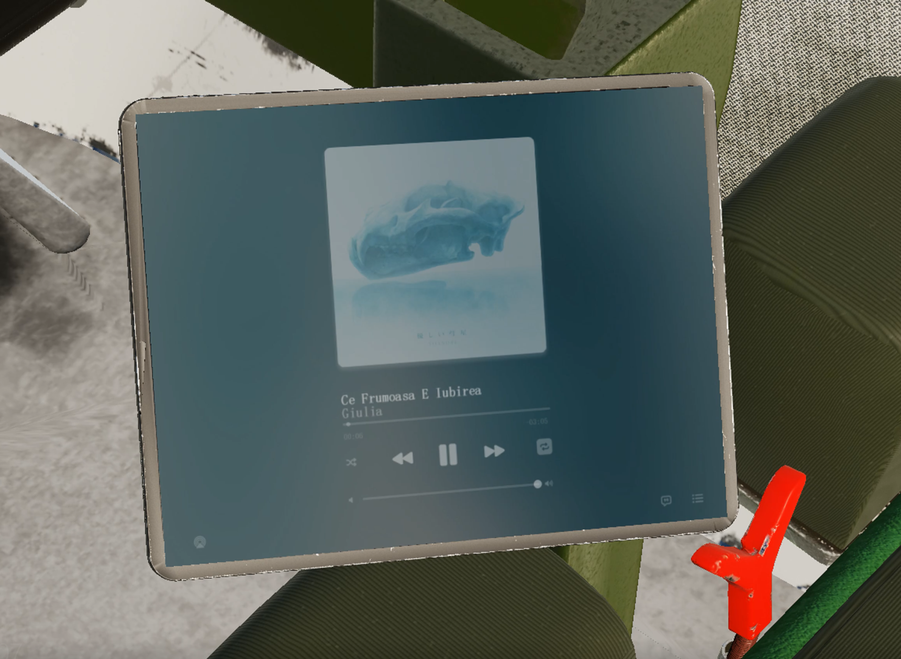

# OGG-Music-Converter


[](RELEASE)
[](LICENSE)<br>
A music converter for an DCS World avionic based in-game virtual media player;<br>
This software uses libraries from the FFmpeg project under the LGPLv2.1

## Table of Contents

- [Background](#background)
- [Install](#install)
- [Usage](#usage)
- [Contributing](#contributing)
- [License](#license)

## Background
This project is aim to make a simple standalone music player with GUI in the DCS World's mod. It contains two parts which are: in-game avionic code and music converter & config generator code.

To allow the simplest usage of both code, the avionic side uses the lua with logic of the avionic system and sound system. It can be simply integrated into any mod. The convert/config side use the c++ with win32api to create a portable execute file.

Serval Libiaries are used to collect the media metadata and convert the media into game supported format. The lib license info can be checked in the [License](#license).

In-Game Preview: 

## Install
### Avionics Lua Code
1. The lua codes are in ```Mp3Code/``` folder. 
2. Put the ```Mp3Code/Cockpit``` into ```<your mod path>/Cockpit```
3. Config your ```device_init.lua``` to add the indicator and device
4. Add the control commands into both ```input``` and ```commanddef```
5. Run and Check if any bug happens 

### Media Convert and Config Generate Code
#### Compile Requirements
1. A **[64-bit Microsoft Visual Studio](https://visualstudio.microsoft.com/)** is required to compile the convert/config code. (Develop is under **WIN10 MSVS 17 2022**)
2. You can compile your own **[TagLib(in static mode)](https://github.com/taglib/taglib/blob/master/INSTALL.md)** and **[FFmpeg](https://ffmpeg.org)**.
3. The repository has include one compiled x86-64 windows version Taglib
#### Pack the Release
1. Compile using X64-Release Mod.
2. Create a ```InputMusic``` folder in project folder
3. Check the ```OGG_Converter.exe``` is working properly in project path
4. Copy the ```LICENSE```, ```docs/*.html``` , ```bin/```, ```InputMusic``` into a New Release Folder.
5. Move the ```OGG_Converter.exe``` from ```bin/``` to Release Root Folder
6. The package is complete to release

## Usage
[User Guidence](docs/UserGuideEN.md)

## Contributing
Feel free to dive in! [Open an issue](https://github.com/corsaircat/ogg-music-converter/issues/new) or submit PRs.
### Contributors
<a href="https://github.com/CorsairCat">CorsairCat</a><br>
<a href="https://github.com/wangmiaowj">wangmiaowj</a>

## License

+ This software uses code of <a href=http://ffmpeg.org>FFmpeg</a> licensed under the <a href=http://www.gnu.org/licenses/old-licenses/lgpl-2.1.html>LGPLv2.1</a> and its source can be downloaded <a href=https://github.com/CorsairCat/OGG-Music-Converter>here</a>
+ FFmpeg is a trademark of Fabrice Bellard, originator of the FFmpeg project.
+ This software uses code of <a href=https://taglib.org>TagLib</a> licensed under the <a href=http://www.gnu.org/licenses/old-licenses/lgpl-2.1.html>LGPLv2.1</a> and its source can be downloaded <a href=https://github.com/CorsairCat/OGG-Music-Converter>here</a>
+ TagLib is a library for reading and editing the metadata of several popular audio formats. <br>
[LGPL2.1 © Corsaircat](LICENSE)
